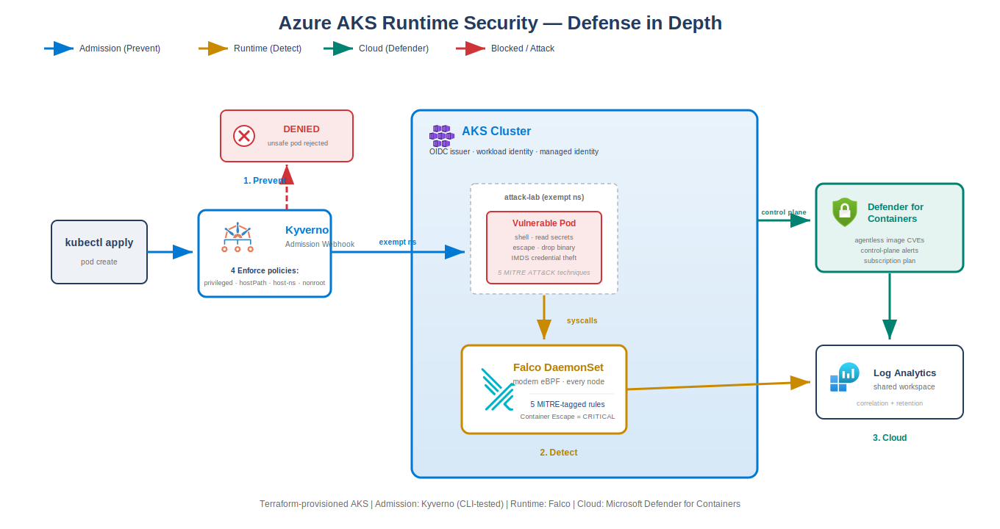

# Azure AKS Runtime Security

[](https://github.com/jordann6/azure-aks-runtime-security/actions/workflows/security-scan.yml)

Defense in depth for a running AKS cluster: admission control, runtime threat
detection, and cloud-native container security layered on one cluster, with the
attacks that each layer stops or catches scripted so the whole thing is
reproducible. This is the Kubernetes runtime-security counterpart to the AWS
[cloud-security-lab](https://github.com/jordann6/cloud-security-lab), built on a
different policy engine and detection stack to show the pattern is not tool
specific.

## Project Outcomes

- Stood up an AKS cluster in Terraform with OIDC issuer, workload identity, Azure Monitor, and Microsoft Defender for Containers wired to a shared Log Analytics workspace
- Enforced four Kyverno admission policies (no privileged containers, no host namespaces, no hostPath, runAsNonRoot required) that reject unsafe pods before they run
- Detected five runtime attack techniques with custom MITRE-tagged Falco rules: shell spawning, sensitive file reads, container escape via mount, dropped binary execution, and Azure IMDS credential theft
- Added Microsoft Defender for Containers for agentless image CVE scanning and control-plane threat alerts on top of the in-cluster controls
- Unit-tested every Kyverno policy offline with the Kyverno CLI against known-good and known-bad pods, gating them in CI before they reach a cluster
- Scripted an attack driver that proves admission control blocks the bad pod, then runs the same pod in an exempt namespace to demonstrate runtime detection

## Architecture



Three independent controls on one cluster, each acting at a different layer so an
attack that evades one is caught by the next.

| Layer | Tool | Acts at | Model |
| ----- | ---- | ------- | ----- |
| Admission | Kyverno | Pod create/update | Prevent |
| Runtime | Falco (modern eBPF) | Node syscalls | Detect |
| Cloud | Microsoft Defender for Containers | Subscription / control plane | Detect + posture |

Full control and detection catalog: [docs/runtime-security.md](docs/runtime-security.md).

### Infrastructure (Terraform)

A single stack provisions a resource group, a Log Analytics workspace, and an AKS
cluster with `oidc_issuer_enabled`, `workload_identity_enabled`, and the
`azure_policy` and `oms_agent` add-ons. The `microsoft_defender` block links the
Defender sensor to the workspace, and a subscription-level pricing plan turns on
Defender for Containers (gated behind a variable because it is a subscription
setting other workloads may already own). System-assigned managed identity means
no stored credentials anywhere in the build.

### Admission control (Kyverno)

Four `Enforce`-mode ClusterPolicies implement the Pod Security Standards controls
that matter most for runtime safety. Kyverno was chosen over OPA Gatekeeper (used
in the AWS lab) specifically to show range across both dominant Kubernetes policy
engines. The policies exclude only system namespaces.

### Runtime detection (Falco)

Falco runs as a DaemonSet with the `modern_ebpf` driver, which needs no kernel
headers on the stock AKS node image. Five custom rules, each tagged with a MITRE
ATT&CK technique ID, cover the runtime attack scenarios the lab drives.

### Cloud detection (Defender for Containers)

Adds agentless image scanning, control-plane threat alerts, and posture
recommendations mapped to the Microsoft cloud security benchmark. Falco covers
node-level syscall behavior; Defender covers the Azure control plane and image
supply chain.

## Runtime Attack Scenarios

| Attack | Technique | Caught by |
| ------ | --------- | --------- |
| Privileged / hostPath / hostPID pod | T1610 | Kyverno (blocked at admission) |
| Terminal shell in container | T1059 | Falco |
| Read /etc/shadow, service account token | T1552 | Falco |
| Container escape via host mount | T1611 | Falco (CRITICAL) |
| Drop and execute new binary | T1105 | Falco |
| Reach Azure IMDS for credentials | T1552.005 | Falco |

The scenarios and admission coverage are captured as an importable ATT&CK
Navigator layer: [docs/mitre-navigator-layer.json](docs/mitre-navigator-layer.json).

## Tech Stack

| Category | Tools |
| -------- | ----- |
| Infrastructure as Code | Terraform (azurerm, remote azurerm backend) |
| Cloud Provider | Azure (AKS, Log Analytics, Microsoft Defender for Cloud) |
| Admission Control | Kyverno (ClusterPolicy, Kyverno CLI tests) |
| Runtime Security | Falco (modern eBPF), Falcosidekick |
| Cloud Detection | Microsoft Defender for Containers |
| Identity | Managed identity, OIDC issuer, workload identity |
| Framework | MITRE ATT&CK, Pod Security Standards |

## Project Structure

```
azure-aks-runtime-security/
  Makefile                        one-command deploy / harden / attack / destroy
  terraform/                      AKS + Log Analytics + Defender for Containers
  k8s/
    falco/
      install.sh
      values.yaml                 modern eBPF driver + 5 MITRE-tagged rules
    kyverno/
      install.sh
      policies/                   4 Enforce-mode ClusterPolicies
      tests/                      Kyverno CLI test suite + resources
    attack-scenarios/
      vulnerable-pod.yaml
      run-runtime-attacks.sh      proves admission block, then runtime detection
  docs/
    runtime-security.md           control + detection catalog
    mitre-navigator-layer.json    importable ATT&CK Navigator layer
  .github/workflows/
    security-scan.yml             gitleaks, terraform, kyverno test, checkov, trivy
```

## Deployment

**Prerequisites:** Azure CLI logged in (`az login`), Terraform, Helm, kubectl.

```bash
# 1. Provision the cluster and Defender plan
make deploy

# 2. Fetch kubeconfig
make credentials

# 3. Install the two in-cluster controls
make falco
make kyverno

# 4. Run the attack driver: admission block, then runtime detection
make runtime-attack
```

**Policy tests (no cluster required):**

```bash
make policy-test    # or: kyverno test k8s/kyverno/tests/
```

## Teardown

```bash
make destroy
```
